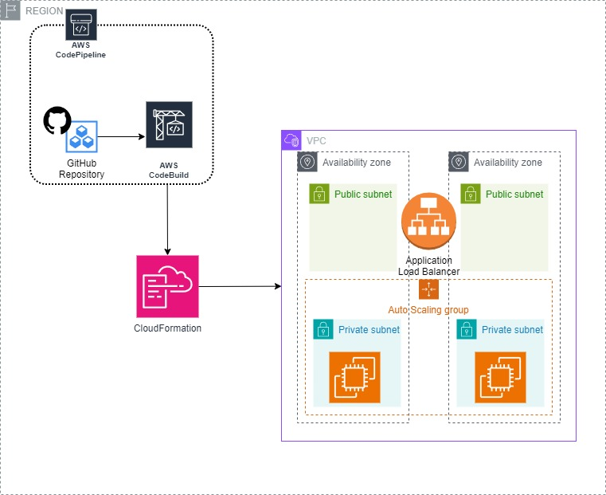

Prerequisiti:

Una VPC con due subnet pubbliche e due subnet private.
Routing table configurate correttamente per le subnet.
Un Internet Gateway per le subnet pubbliche.
Un NAT Gateway per le subnet private.
Repository ECR private con i nomi ecrapache e ecrwordpress.
Passaggi Successivi:

Creare la Pipeline:

Accedere alla console AWS e vai al servizio CodePipeline.
Cliccare su "Create pipeline".
Configurare la pipeline inserendo un nome e selezionando la tua repository GitHub come origine.
Configurare gli stage successivi come descritto di seguito.
Stage di Build:

Aggiungi uno stage di build alla tua pipeline.
Selezionare CodeBuild come provider del servizio.
Configurare le impostazioni di CodeBuild per eseguire il build utilizzando il file buildspec.yaml presente nella repository di Source.

Osservazioni:

Avendo utilizzato un account di test personale, sarà neccessario all'interno del file di parametri denominato "ec2.json" cambiare le subnet,
in maniera tale da poter effettivamente testare l'infrastruttura con dei parametri corretti. 

